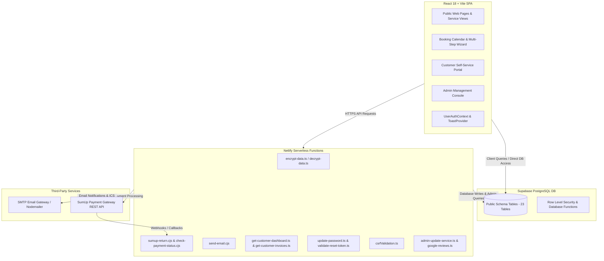
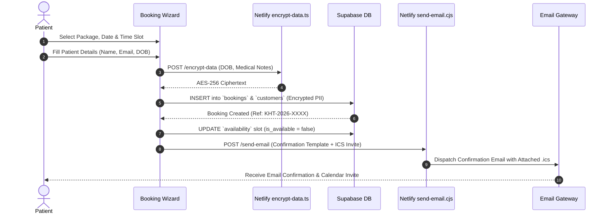
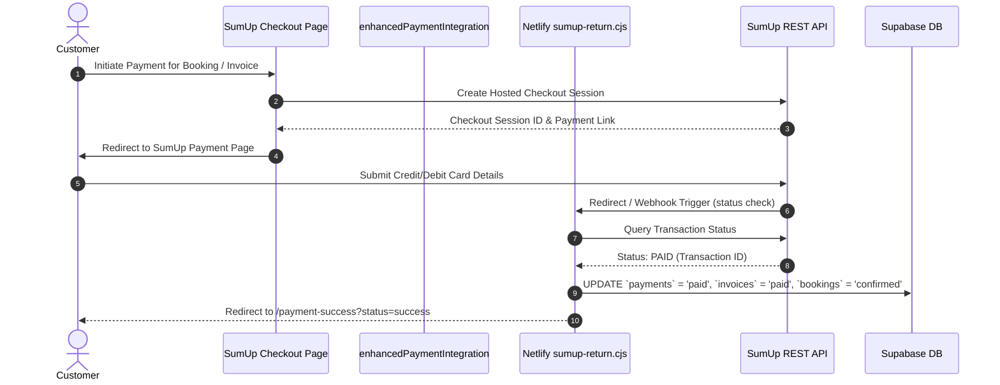
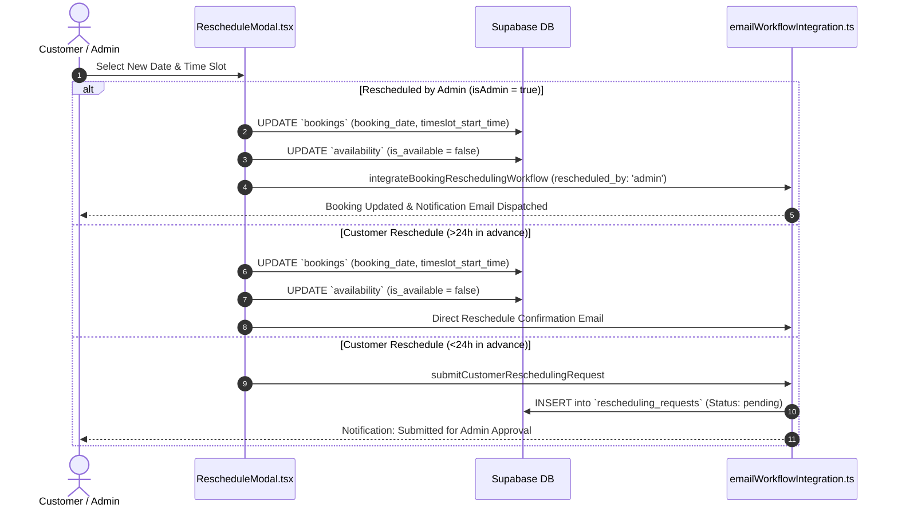

# KH THERAPY - Comprehensive System Architecture & Memory Blueprint

> **Notice to AI Agents**: This document is the Single Source of Truth (SSOT) for the architecture, data models, workflows, and key functional features of the KH Therapy platform. You **MUST** review this file before making changes and update it immediately after any structural, schema, API, or workflow modifications. Refer to [`AGENTS.md`](file:///Users/prashant/Documents/Application%20directory/KH/AGENTS.md) for agent operational instructions.

---

## 📐 1. System Architecture Overview

KH Therapy is a modern physiotherapy clinic management system built with a client-side rendered React 18 single-page application (SPA), backed by Netlify serverless functions for backend microservices, and a Supabase PostgreSQL database for persistent storage, security policies, and real-time state.



---

## 📁 2. Directory Structure & Key Components

```
KH/
├── AGENTS.md                 # MANDATORY AI agent instructions & MEMORY update directives
├── MEMORY.md                 # Single Source of Truth system blueprint & architecture
├── src/
│   ├── components/
│   │   ├── admin/            # Admin console views (Bookings, Payments, Invoices, Availability, CustomerManagement, GdprComplianceAdmin, Reports, Services, PaymentGatewayManagement)
│   │   ├── auth/             # Auth components (Login Modal, Register)
│   │   ├── dashboard/        # Customer & Admin dashboard widgets
│   │   ├── layout/           # Header, Footer, Navigation, Layout wrapper
│   │   ├── payment/          # Payment modals and SumUp checkout components
│   │   ├── user/             # Customer Portal views (UserBookings, UserInvoices, UserPayments, UserProfile, RescheduleModal, PrivacySettings, ForgotPassword, ResetPassword, FirstLoginPasswordChange)
│   │   ├── BookingForm.tsx   # Interactive booking wizard & package selector
│   │   └── CustomerReschedulingForm.tsx # Rescheduling request form
│   ├── contexts/
│   │   └── UserAuthContext.tsx # Centralized customer/admin auth & session management
│   ├── pages/                # SPA Pages (HomePage, BookingPage, AdminConsole, SumUpCheckoutPage, ServicesPage, ContactPage, PaymentSuccessPage, PaymentCancelledPage, PrivacyPolicyPage, TermsOfServicePage, CookiePolicyPage)
│   ├── services/             # Core domain services (invoiceService, pricingService, googleReviews)
│   ├── utils/                # Utility modules & API wrappers
│   │   ├── adminGdprUtils.ts            # Admin GDPR decryption & log helpers
│   │   ├── bookingEmailWorkflow.ts      # Confirmation & notification email generator
│   │   ├── csrfProtection.ts            # Client-side CSRF token management
│   │   ├── customerBookingUtils.ts      # Customer booking management & filters
│   │   ├── emailWorkflowIntegration.ts  # Integrated booking/rescheduling email workflow
│   │   ├── encryptionServerWrapper.ts   # Client wrapper for server-side PII encryption (AES-256)
│   │   ├── enhancedPaymentIntegration.ts# SumUp payment workflow helper
│   │   ├── gdprUtils.ts                 # GDPR compliance, export & anonymization utils
│   │   ├── invoiceDataTransformer.ts    # Invoice format conversion helpers
│   │   ├── paymentManagementUtils.ts    # Admin payment management API helper
│   │   ├── paymentRequestUtils.ts       # Payment request creation & tracking
│   │   ├── pdfInvoiceGenerator.ts       # jsPDF invoice export helper
│   │   ├── reschedulingApi.ts           # Rescheduling request database API
│   │   ├── reschedulingValidation.ts    # 24-hour rule & eligibility validation
│   │   ├── sumupRealApiImplementation.ts# Direct SumUp API REST client wrapper
│   │   └── userManagementUtils.ts       # User account & authentication management
│   ├── supabaseClient.ts     # Supabase client singleton (`persistSession: false`)
│   └── App.tsx               # Primary React routing & suspense lazy loading setup
├── netlify/
│   └── functions/            # Netlify Serverless Functions (Node.js/TypeScript)
│       ├── admin-update-service.ts      # Service management API
│       ├── check-payment-status.cjs     # SumUp payment status poll
│       ├── csrfValidation.ts            # CSRF token validation middleware
│       ├── decrypt-data.ts              # Server-side AES-256 decryption function
│       ├── encrypt-data.ts              # Server-side AES-256 encryption function
│       ├── get-customer-bookings.ts     # Customer portal booking retrieval
│       ├── get-customer-dashboard.ts    # Customer dashboard metrics
│       ├── get-customer-invoices.ts     # Customer invoice retrieval
│       ├── google-reviews.ts            # Google Places API reviews proxy
│       ├── send-email.cjs               # Nodemailer SMTP email & ICS invite dispatcher
│       ├── sumup-return.cjs             # SumUp checkout callback webhook handler
│       ├── update-password.ts           # Password update function
│       └── validate-reset-token.ts      # Password reset token validator
├── database/                 # Migration scripts, schema definitions, RLS fixes
└── docs/                     # Technical specifications & refactoring documentation
```

---

## 🚀 3. Key Functional Features

### 3.1 Public & Patient Booking System
- **Interactive Multi-Step Booking Wizard**: Seamless step-by-step booking flow allowing patients to select treatments, locations, dates, and time slots.
- **Service Package & Pricing Catalog**: Supports dynamic packages including In-Hour (€70), Out-Of-Hour (€90), and Home Visits (€120). Dynamic slot filtering ensures matching availability based on package type.
- **Patient Selector**: Supports multiple family members/patients under a single customer email address, allowing parents/guardians to book appointments for dependants while maintaining separate patient profiles.
- **Server-Side PII Encryption**: Patient Date of Birth and sensitive notes are encrypted via AES-256 using Netlify serverless functions (`encrypt-data.ts`) prior to storage.
- **Automated Email & ICS Invites**: Instant email confirmation dispatched via Nodemailer SMTP complete with attached `.ics` calendar invitation files for Apple Calendar, Google Calendar, and Outlook.

### 3.2 Customer Self-Service Portal
- **Custom Authentication**: Secure authentication system supporting register, login, password reset via email tokens, and mandatory first-login password changes (`UserAuthContext.tsx`).
- **Customer Dashboard**: Overview of upcoming appointments, past medical sessions, unpaid invoices, and payment request history.
- **Appointment Management & Self-Rescheduling**:
  - Direct rescheduling for appointments >24 hours in advance.
  - Automated approval request workflow (`rescheduling_requests`) for customer reschedule attempts within 24 hours.
- **Online Invoice & Payment Hub**: View itemized PDF invoices and execute instant online card payments via SumUp hosted checkout.
- **Privacy & GDPR Control Panel**: Patients can manage marketing/privacy consents, export their personal data archive, or submit account anonymization requests.

### 3.3 Admin Management Console (`/admin-console`)
- **Bookings Management (`Bookings.tsx`)**:
  - Complete operational table of all clinic bookings with search, date range, and status filtering.
  - Manual booking creation for walk-in or telephone clients.
  - **Admin Direct Rescheduling**: Admins can reschedule any appointment at any time using `RescheduleModal` with `isAdmin={true}`, bypassing customer 24-hour approval restrictions.
  - Booking status management (*confirmed, completed, cancelled*) with automated email notifications to customers.
- **Availability & Schedule Engine (`Availability.tsx`)**:
  - Automated availability generator based on customizable weekly schedule templates.
  - Real-time slot management with slot-type categorization (*in-hour* vs *out-of-hour*).
  - One-click slot blocking/unblocking and custom time-range overrides.
- **Services & Pricing Management (`Services.tsx`)**:
  - Service catalog manager with price, duration, category, and visit-type configuration.
  - Real-time service activation/deactivation.
- **Invoice & Financial Management (`InvoiceManagement.tsx`)**:
  - Automated invoice generation upon booking confirmation.
  - Manual multi-item invoice creator with subtotal, VAT calculation, and custom line items.
  - Instant PDF invoice generation & download powered by `jsPDF`.
  - Direct email dispatch of invoice payment links to customers.
- **Payment & Gateway Administration (`PaymentManagement.tsx` & `PaymentGatewayManagement.tsx`)**:
  - SumUp payment gateway configuration and merchant credential management.
  - Complete audit log of all card transactions, payment requests, and webhook logs.
  - Manual payment reconciliation and refund status tracking.
- **Customer Management (`CustomerManagement.tsx`)**:
  - Comprehensive customer database with secure PII decryption for authorized administrators.
  - Linked patient records view, booking history, and billing summary.
- **GDPR Compliance Admin (`GdprComplianceAdmin.tsx`)**:
  - Centralized audit log (`gdpr_audit_log`) tracking all administrative PII views and data exports.
  - Data Subject Request (DSR) queue for handling data export and right-to-be-forgotten requests.
- **Reports & Operational Analytics (`Reports.tsx`)**:
  - Revenue analytics, booking volume breakdown, occupancy rates, and service popularity charts.

---

## 📊 4. Data Model & Database Schema

### Entity-Relationship Overview

```mermaid
erdiagram
    CUSTOMERS ||--o{ BOOKINGS : "places"
    CUSTOMERS ||--o{ INVOICES : "receives"
    CUSTOMERS ||--o{ PAYMENTS : "makes"
    CUSTOMERS ||--o{ PAYMENT_REQUESTS : "receives"
    CUSTOMERS ||--o{ RESCHEDULING_REQUESTS : "requests"
    CUSTOMERS ||--o{ CONSENT_RECORDS : "grants"

    BOOKINGS ||--o{ RESCHEDULING_REQUESTS : "has"
    INVOICES ||--o{ INVOICE_ITEMS : "contains"
    INVOICES ||--o{ PAYMENTS : "settled_by"
    INVOICES ||--o{ PAYMENT_REQUESTS : "linked_to"

    SERVICES ||--o{ SERVICES_TIME_SLOTS : "defines"
    SERVICES ||--o{ BOOKINGS : "categorizes"
    ADMINS ||--o{ RESCHEDULING_REQUESTS : "processes"
```

### Core Schema Specification

#### 1. `customers` Table
- `id` (SERIAL PRIMARY KEY)
- `auth_user_id` (UUID, FK -> `auth.users.id` NULLABLE)
- `first_name` (VARCHAR 100 NOT NULL)
- `last_name` (VARCHAR 100 NOT NULL)
- `email` (VARCHAR 255 NOT NULL)
- `phone` (VARCHAR 50)
- `date_of_birth` (TEXT) — *Encrypted AES-256 PII*
- `address_line1`, `address_line2`, `city`, `county`, `eircode` (VARCHAR)
- `gdpr_anonymized` (BOOLEAN DEFAULT FALSE)
- `privacy_consent_given` (BOOLEAN), `marketing_consent` (BOOLEAN)
- `password_hash` (VARCHAR 255) — *Used for custom portal authentication*
- `force_password_change` (BOOLEAN DEFAULT FALSE)
- `created_at`, `updated_at` (TIMESTAMPTZ)

#### 2. `bookings` Table
- `id` (UUID PRIMARY KEY DEFAULT gen_random_uuid())
- `customer_id` (INTEGER FK -> `customers.id` ON DELETE CASCADE)
- `booking_reference` (VARCHAR UNIQUE) — *e.g., KHT-2026-XXXX*
- `booking_date` (TIMESTAMPTZ / ISO STRING) — *Primary booking date/time e.g., 2026-10-05T10:00:00*
- `timeslot_start_time` (TIME) — *Start time e.g., 10:00:00*
- `timeslot_end_time` (TIME) — *End time e.g., 11:00:00*
- `appointment_date` (DATE NULLABLE) — *Legacy date field*
- `appointment_time` (TIME NULLABLE) — *Legacy time field*
- `package_name` (VARCHAR) — *Service package name*
- `visit_type` (VARCHAR DEFAULT 'clinic') — *'clinic' or 'home_visit'*
- `status` (VARCHAR DEFAULT 'confirmed') — *'pending', 'confirmed', 'completed', 'cancelled'*
- `total_price` (NUMERIC(10,2))
- `notes` (TEXT)
- `created_at`, `updated_at` (TIMESTAMPTZ)

#### 3. `rescheduling_requests` Table
- `id` (UUID PRIMARY KEY DEFAULT gen_random_uuid())
- `booking_id` (UUID FK -> `bookings.id` ON DELETE CASCADE)
- `customer_id` (INTEGER FK -> `customers.id` ON DELETE CASCADE)
- `original_appointment_date` (DATE NOT NULL)
- `original_appointment_time` (TIME NOT NULL)
- `requested_appointment_date` (DATE NOT NULL)
- `requested_appointment_time` (TIME NOT NULL)
- `reschedule_reason` (TEXT)
- `customer_notes` (TEXT)
- `status` (VARCHAR DEFAULT 'pending') — *'pending', 'approved', 'rejected', 'cancelled'*
- `admin_notes` (TEXT)
- `admin_user_id` (UUID)
- `requested_at`, `processed_at`, `created_at`, `updated_at` (TIMESTAMPTZ)

#### 4. `invoices` & `invoice_items` Tables
- **`invoices`**: `id` (SERIAL PK), `invoice_number` (VARCHAR UNIQUE), `customer_id` (FK -> `customers.id`), `booking_id` (FK -> `bookings.id`), `subtotal`, `vat_amount`, `total_amount`, `status` (*'unpaid', 'paid', 'overdue', 'cancelled'*), `due_date`, `created_at`.
- **`invoice_items`**: `id` (SERIAL PK), `invoice_id` (FK -> `invoices.id`), `description`, `quantity`, `unit_price`, `total_price`.

#### 5. `payments` & `payment_requests` Tables
- **`payments`**: `id` (SERIAL PK), `customer_id`, `invoice_id`, `booking_id`, `sumup_transaction_id`, `sumup_checkout_id`, `amount`, `currency`, `status` (*'pending', 'processing', 'paid', 'failed', 'refunded'*), `payment_method`, `payment_date`.
- **`payment_requests`**: `id` (SERIAL PK), `customer_id`, `invoice_id`, `amount`, `status` (*'pending', 'sent', 'paid', 'expired'*), `request_token`, `sumup_checkout_url`, `expires_at`.

#### 6. `availability` & Templates Tables
- **`availability`**: `id` (SERIAL PK), `date` (DATE), `start_time` (TIME), `end_time` (TIME), `slot_type` (*'in-hour' | 'out-of-hour'*), `is_available` (BOOLEAN DEFAULT TRUE), `booking_id` (FK -> `bookings.id`).
- **`availability_templates`** & **`availability_template_slots`**: Weekly recurring template definitions.

#### 7. `gdpr_audit_log` Table
- `id` (SERIAL PK), `admin_email` (VARCHAR), `action` (VARCHAR), `target_customer_id` (INTEGER), `ip_address` (VARCHAR), `details` (JSONB), `created_at` (TIMESTAMPTZ).

---

## 🔄 5. Core Workflows & System Sequences

### 5.1 Booking & PII Encryption Workflow



### 5.2 SumUp Online Payment Workflow



### 5.3 Rescheduling Workflow (Customer vs Admin)



---

## ⚡ 6. Netlify Serverless Functions Reference

| Function Name | Description | Key Security / Operations |
| :--- | :--- | :--- |
| `admin-update-service.ts` | Service catalog update API for admins | Admin role check, Supabase service role key |
| `check-payment-status.cjs` | Polls transaction status from SumUp REST API | SumUp API authentication, DB update |
| `csrfValidation.ts` | CSRF token validation middleware | CSRF header check for state-changing calls |
| `decrypt-data.ts` | Server-side AES-256 decryption service | `ENCRYPTION_KEY` secret isolation |
| `encrypt-data.ts` | Server-side AES-256 encryption service | `ENCRYPTION_KEY` secret isolation |
| `get-customer-bookings.ts` | Customer portal booking query endpoint | Auth token verification |
| `get-customer-dashboard.ts` | Aggregates customer stats & appointments | Customer auth session check |
| `get-customer-invoices.ts` | Retrieves customer invoice documents | Customer auth session check |
| `google-reviews.ts` | Google Places API proxy for reviews | API Key protection |
| `send-email.cjs` | Transactional email & `.ics` calendar invite sender | Nodemailer SMTP gateway |
| `sumup-return.cjs` | SumUp payment callback webhook & return handler | Payment reconciliation & DB sync |
| `update-password.ts` | Handles user password changes | Password hash verification |
| `validate-reset-token.ts` | Validates email password reset tokens | Expiry & single-use token check |

---

## 🛠️ 7. Environment & Configuration Reference

### Frontend Environment Variables (`.env`)
- `VITE_SUPABASE_URL`: Supabase project URL
- `VITE_SUPABASE_PUBLISHABLE_KEY`: Supabase anon/public API key
- `VITE_SITE_URL`: Application base origin (`https://khtherapy.ie` or `http://localhost:5173`)
- `VITE_ENCRYPTION_KEY`: Development fallback encryption key (*development only*)

### Serverless Backend Secrets (Netlify Dashboard)
- `SUPABASE_SERVICE_ROLE_KEY`: Admin service role key for RLS bypass in serverless functions
- `ENCRYPTION_KEY`: Server-side AES-256 master key for PII encryption
- `SUMUP_SECRET_KEY` / `SUMUP_MERCHANT_CODE`: Credentials for SumUp API
- `SMTP_HOST`, `SMTP_PORT`, `SMTP_USER`, `SMTP_PASS`: Mail server credentials for Nodemailer

---

## 📝 8. Maintenance Directives for AI Agents

> **MANDATORY FOR ALL AI AGENTS WORKING ON THIS REPOSITORY**

1. **Keep `MEMORY.md` Up To Date**: Any AI agent modifying schema, components, workflows, serverless functions, or environment configurations MUST update this document prior to concluding the task.
2. **Follow Instructions in [`AGENTS.md`](file:///Users/prashant/Documents/Application%20directory/KH/AGENTS.md)**: Adhere strictly to the project rules, coding standards, PII encryption directives, and build verification commands (`npx tsc --noEmit`).

---
*Last scanned & generated: 2026-09-29*
