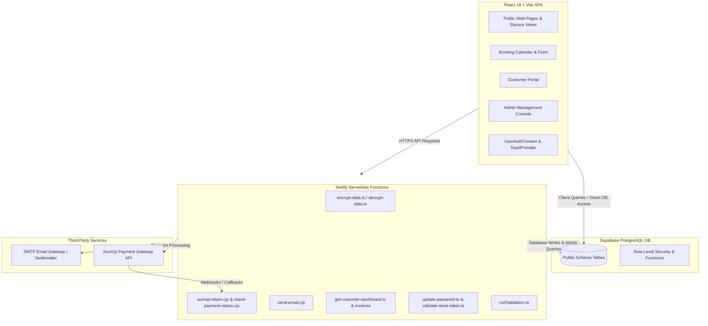
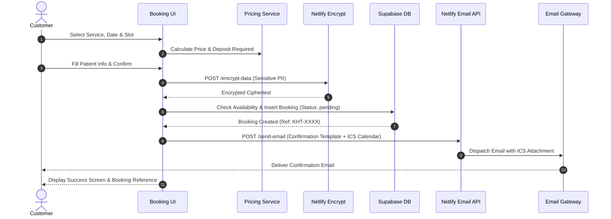
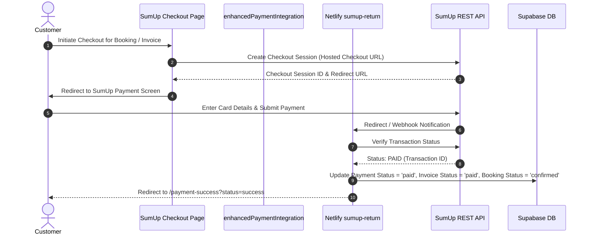
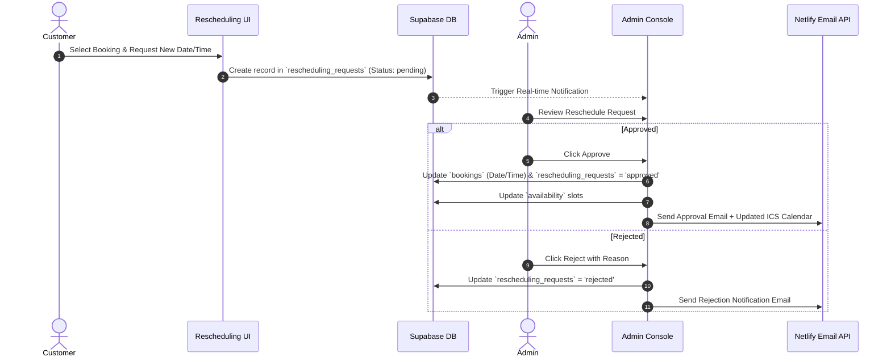

# KH THERAPY - Comprehensive System Architecture & Memory Blueprint

> **Notice to AI Agents**: This document is the single source of truth (SSOT) for the architecture, data models, workflows, and system rules of the KH Therapy platform. You **MUST** review this file before making changes and update it immediately after any structural, schema, API, or workflow modifications.

---

## 📐 1. System Architecture Overview

KH Therapy is a modern physiotherapy clinic management system built with a client-side rendered React 18 single-page application, backed by Netlify serverless functions for backend operations, and a Supabase PostgreSQL database for persistent storage and real-time state.



---

## 📁 2. Directory Structure & Key Components

```
KH/
├── src/
│   ├── components/
│   │   ├── admin/            # Admin console sub-views (Bookings, Payments, Invoices, Availability)
│   │   ├── auth/             # Authentication components (Login Modal, Register)
│   │   ├── dashboard/        # Customer & Admin dashboard widgets
│   │   ├── layout/           # Header, Footer, Navigation, Layout wrapper
│   │   ├── payment/          # Payment modals and SumUp integration components
│   │   ├── user/             # User profile, password reset, appointment history
│   │   ├── BookingForm.tsx   # Interactive booking wizard & validation logic
│   │   └── CustomerReschedulingForm.tsx # Rescheduling request form
│   ├── contexts/
│   │   └── UserAuthContext.tsx # Centralized customer/admin auth & session management
│   ├── pages/                # Route pages (HomePage, BookingPage, AdminConsole, SumUpCheckoutPage, etc.)
│   ├── services/             # Core domain services (invoiceService, pricingService, googleReviews)
│   ├── utils/                # Utility modules & API wrappers
│   │   ├── encryptionServerWrapper.ts   # Client wrapper for server-side PII encryption
│   │   ├── enhancedPaymentIntegration.ts# SumUp payment workflow helper
│   │   ├── sumupRealApiImplementation.ts# Direct SumUp API call wrapper
│   │   ├── bookingEmailWorkflow.ts      # Confirmation & notification email generator
│   │   ├── customerBookingUtils.ts      # Customer booking management & filters
│   │   ├── reschedulingWorkflow.ts      # Rescheduling request handling
│   │   ├── pdfInvoiceGenerator.ts       # jsPDF invoice export helper
│   │   └── csrfProtection.ts            # Client-side CSRF token management
│   ├── supabaseClient.ts     # Supabase client singleton setup
│   └── App.tsx               # Primary React routing & suspense lazy loading setup
├── netlify/
│   └── functions/            # Netlify Serverless Functions (Node.js/TypeScript)
│       ├── encrypt-data.ts / decrypt-data.ts
│       ├── sumup-return.cjs
│       ├── send-email.cjs
│       ├── get-customer-dashboard.ts
│       └── update-password.ts
├── database/                 # SQL Migration scripts, schema definitions, RLS rules
├── scripts/                  # Node.js maintenance scripts (schema analyzer, RLS check/fix)
└── docs/                     # Detailed technical documentations & fix guides
```

---

## 📊 3. Data Model & Database Schema

### Entity-Relationship Diagram

```mermaid
erdiagram
    CUSTOMERS ||--o{ BOOKINGS : "places"
    CUSTOMERS ||--o{ INVOICES : "receives"
    CUSTOMERS ||--o{ PAYMENTS : "makes"
    CUSTOMERS ||--o{ PAYMENT_REQUESTS : "receives"
    CUSTOMERS ||--o{ RESCHEDULING_REQUESTS : "requests"
    CUSTOMERS ||--o{ CONSENT_RECORDS : "grants"

    BOOKINGS ||--o{ RESCHEDULING_REQUESTS : "has"
    INVOICES ||--o{ INVOICE_ITEMS : "contains"
    INVOICES ||--o{ PAYMENTS : "settled_by"
    INVOICES ||--o{ PAYMENT_REQUESTS : "linked_to"

    ADMINS ||--o{ RESCHEDULING_REQUESTS : "processes"
```

### Core Schema Specification

#### 1. `customers` Table
- `id` (SERIAL PRIMARY KEY)
- `auth_user_id` (UUID, FK -> `auth.users.id` NULLABLE)
- `first_name` (VARCHAR 100)
- `last_name` (VARCHAR 100)
- `email` (VARCHAR 255 UNIQUE NOT NULL)
- `phone` (VARCHAR 50)
- `date_of_birth` (TEXT) — *Encrypted PII*
- `address_line1`, `address_line2`, `city`, `county`, `eircode` (VARCHAR)
- `gdpr_anonymized` (BOOLEAN DEFAULT FALSE)
- `privacy_consent_given` (BOOLEAN), `marketing_consent` (BOOLEAN)
- `password_hash` (VARCHAR 255) — *Used for custom portal auth*
- `created_at`, `updated_at` (TIMESTAMPTZ)

#### 2. `bookings` Table
- `id` (UUID / SERIAL PRIMARY KEY)
- `customer_id` (INTEGER FK -> `customers.id` ON DELETE CASCADE)
- `booking_reference` (VARCHAR UNIQUE) — *e.g., KHT-2026-XXXX*
- `appointment_date` (DATE NOT NULL)
- `appointment_time` (TIME NOT NULL)
- `service_id` (INTEGER) / `service_name` (VARCHAR)
- `visit_type` (VARCHAR) — *'clinic' or 'home_visit'*
- `status` (VARCHAR DEFAULT 'pending') — *'pending', 'confirmed', 'completed', 'cancelled'*
- `total_price` (NUMERIC(10,2))
- `notes` (TEXT)
- `created_at`, `updated_at` (TIMESTAMPTZ)

#### 3. `invoices` & `invoice_items` Tables
- **`invoices`**: `id` (SERIAL PK), `invoice_number` (VARCHAR UNIQUE), `customer_id` (FK -> `customers.id`), `booking_id` (FK -> `bookings.id`), `subtotal`, `vat_amount`, `total_amount`, `status` (*'unpaid', 'paid', 'overdue', 'cancelled'*), `due_date`, `created_at`.
- **`invoice_items`**: `id` (SERIAL PK), `invoice_id` (FK -> `invoices.id`), `description`, `quantity`, `unit_price`, `total_price`.

#### 4. `payments` & `payment_requests` Tables
- **`payments`**: `id` (SERIAL PK), `customer_id`, `invoice_id`, `booking_id`, `sumup_transaction_id`, `sumup_checkout_id`, `amount`, `currency`, `status` (*'pending', 'processing', 'paid', 'failed', 'refunded'*), `payment_method`, `payment_date`.
- **`payment_requests`**: `id` (SERIAL PK), `customer_id`, `invoice_id`, `amount`, `status` (*'pending', 'sent', 'paid', 'expired'*), `request_token`, `sumup_checkout_url`, `expires_at`.

#### 5. `rescheduling_requests` Table
- `id` (UUID PK), `booking_id` (FK -> `bookings.id`), `customer_id` (FK -> `customers.id`), `original_appointment_date`, `original_appointment_time`, `requested_appointment_date`, `requested_appointment_time`, `reschedule_reason`, `status` (*'pending', 'approved', 'rejected', 'cancelled'*), `admin_notes`.

#### 6. `availability` Table
- `id` (SERIAL PK), `date` (DATE), `start_time` (TIME), `end_time` (TIME), `slot_type` (VARCHAR), `is_booked` (BOOLEAN DEFAULT FALSE), `booking_id` (FK -> `bookings.id`).

#### 7. Security, PII & Data Protection Architecture
- **Server-Side PII Encryption**: Sensitive customer fields (e.g. date of birth, medical notes) are encrypted server-side using AES-256 via Netlify functions (`encrypt-data.ts`, `decrypt-data.ts`). Encryption keys remain isolated in server environment variables.
- **CSRF Token Validation**: Tokens are generated on app load and verified via `csrfValidation.ts` Netlify middleware for sensitive operations.
- **Row Level Security (RLS)**: Database tables enforce strict PostgreSQL RLS policies to restrict data access based on authentication role (`authenticated` vs `anon` vs admin email checks).

---

## 🔄 4. Core Workflows & System Sequences

### 4.1 Appointment Booking Workflow



### 4.2 SumUp Online Payment Workflow



### 4.3 Appointment Rescheduling Workflow



---

## 🛠️ 5. Environment & Configuration Reference

### Frontend Environment Variables (`.env`)
- `VITE_SUPABASE_URL`: Supabase project URL
- `VITE_SUPABASE_PUBLISHABLE_KEY`: Supabase anon/public API key
- `VITE_SITE_URL`: Application origin (e.g. `https://khtherapy.ie` or `http://localhost:5173`)
- `VITE_ENCRYPTION_KEY`: Development fallback encryption key (*development only*)

### Serverless Backend Variables (Netlify Dashboard)
- `SUPABASE_SERVICE_ROLE_KEY`: Admin service key for bypass RLS in edge functions
- `ENCRYPTION_KEY`: Server-side AES-256 master key for PII encryption
- `SUMUP_SECRET_KEY` / `SUMUP_MERCHANT_CODE`: Credentials for SumUp API integration
- `SMTP_HOST`, `SMTP_PORT`, `SMTP_USER`, `SMTP_PASS`: Mail server credentials for sending confirmation & invoice emails

---

## 📝 6. Instructions for AI Agents (Maintenance Protocol)

> **MANDATORY FOR ALL AI AGENTS WORKING ON THIS CODEBASE**

To ensure `MEMORY.md` remains 100% accurate and up to date over time, any AI agent performing modifications to this project MUST follow these maintenance rules:

### 1. Trigger Conditions for Updating MEMORY.md
You **MUST** update `MEMORY.md` immediately whenever you perform any of the following actions:
- **Database Schema Changes**: Adding, modifying, or dropping database tables, columns, indexes, foreign keys, or RLS policies.
- **Workflow Modifications**: Altering the booking, payment, email, auth, or rescheduling flows.
- **New Serverless Functions**: Adding or changing endpoints under `netlify/functions/`.
- **New Integrations or Third-Party Services**: Incorporating new APIs, payment gateways, or notification services.
- **Directory Structure / Architectural Shifts**: Moving, renaming, or refactoring major folders or service classes.
- **Environment Variable Changes**: Adding or removing environment variables in `.env` or Netlify configs.

### 2. Update Checklist for AI Agents
When making changes, run through this verification checklist:
1. [ ] Does the entity relationship diagram or table list in Section 3 need updates?
2. [ ] Does the folder structure or key file map in Section 2 accurately reflect newly created or deleted files?
3. [ ] Are all Mermaid sequence diagrams up to date with new steps, functions, or status codes?
4. [ ] Were any new environment variables introduced that should be documented in Section 5?
5. [ ] Is the terminology in this file consistent with the actual code (e.g., exact column names, exact route paths)?

### 3. File Editing Guidelines
- Maintain standard GitHub Flavored Markdown and valid Mermaid diagram syntax.
- Do NOT remove existing context unless code has been explicitly deprecated or deleted.
- Keep sections clean, structured, and easy to read for future human developers and AI assistants.

---
*Last scanned & generated: 2026-09-03*
