# Deposit vs Full Payment Fix

## Issue
The payment system was only creating payment requests for 20% deposit, even when customers selected "Pay Full Amount". This caused:
- Backend recorded all payments as 20% deposits
- Email notifications showed incorrect payment amounts
- Booking status calculations were wrong
- Customers paying full amount were treated as having outstanding balance

## Root Cause
The `createPaymentRequest` function always calculated 20% deposit without considering user's payment type choice. The payment flow had:
1. Payment options UI (deposit vs full) ✅ Working
2. Payment type selection ✅ Working
3. **Payment request creation ❌ Always 20% deposit**
4. **Checkout amount ❌ Using payment request amount (wrong)**
5. **Database records ❌ Showing deposit amount**

## Solution

### 1. Updated Payment Request Creation

**File**: `src/utils/paymentRequestUtils.ts`

Added `paymentType` parameter to `createPaymentRequest`:

```typescript
export async function createPaymentRequest(
  customerId: number,
  serviceName: string,
  bookingDate: string,
  invoiceId?: number | null,
  bookingId?: string | null,
  isInvoicePaymentRequest?: boolean,
  customAmount?: number,
  paymentType?: 'deposit' | 'full' // NEW PARAMETER
): Promise<PaymentRequest | null>
```

**Logic**:
```typescript
if (paymentType === 'full') {
  finalAmount = baseCost; // Full amount
  console.log(`💰 Creating payment request for FULL amount: €${finalAmount}`);
} else {
  finalAmount = Math.round(baseCost * 0.2); // 20% deposit
  console.log(`💰 Creating payment request for DEPOSIT (20%): €${finalAmount} of €${baseCost}`);
}
```

**Notes field updated**:
```typescript
notes: paymentType === 'full'
  ? `Full payment for ${serviceName} appointment on ${date}`
  : `20% deposit for ${serviceName} appointment on ${date}`
```

### 2. Updated PaymentModal to Use Selected Amount

**File**: `src/components/shared/PaymentModal.tsx`

Added props:
```typescript
interface PaymentModalProps {
  // ... existing props
  paymentOptions?: {
    deposit: { amount: number; percentage: number };
    full: { amount: number };
  };
  selectedPaymentType?: 'deposit' | 'full';
}
```

Added helper function:
```typescript
const getActualPaymentAmount = (): number => {
  if (!paymentOptions || !selectedPaymentType) {
    return paymentRequest.amount; // Backward compatibility
  }
  
  if (selectedPaymentType === 'full') {
    console.log(`💰 Using FULL payment amount: €${paymentOptions.full.amount}`);
    return paymentOptions.full.amount;
  } else {
    console.log(`💰 Using DEPOSIT amount: €${paymentOptions.deposit.amount}`);
    return paymentOptions.deposit.amount;
  }
};

const actualPaymentAmount = getActualPaymentAmount();
```

**Update payment request before processing**:
```typescript
// Update the payment request amount if user selected a different amount
if (paymentOptions && actualPaymentAmount !== paymentRequest.amount) {
  console.log(`🔄 Updating payment request from €${paymentRequest.amount} to €${actualPaymentAmount}`);
  
  await supabase
    .from('payment_requests')
    .update({ 
      amount: actualPaymentAmount,
      notes: selectedPaymentType === 'full' 
        ? `Full payment for ${paymentRequest.service_name}`
        : paymentRequest.notes
    })
    .eq('id', paymentRequest.id);
  
  paymentRequest.amount = actualPaymentAmount;
}
```

**Use actual amount in SumUp checkout**:
```typescript
const checkoutResponse = await createSumUpCheckoutSession({
  amount: actualPaymentAmount, // ← Changed from paymentRequest.amount
  description: `${selectedPaymentType === 'full' ? 'Full payment' : '20% deposit'} for ${service}`,
  // ... other params
});
```

### 3. Updated All Booking Flows

#### BookingModal (Quick Book Modal)
**File**: `src/components/user/BookingModal.tsx`

Updated `handlePayNow` to include payment_type:
```typescript
const paymentRequestWithCustomer = {
  ...paymentState.paymentRequest,
  amount: selectedAmount,
  payment_type: paymentType, // ← Added
  // ... rest
};
```

Updated PaymentModal call:
```typescript
<PaymentModal
  isOpen={showPaymentModal}
  paymentRequest={selectedPaymentRequest}
  onClose={() => setShowPaymentModal(false)}
  onPaymentComplete={handlePaymentModalComplete}
  paymentOptions={paymentState.paymentOptions} // ← Added
  selectedPaymentType={selectedPaymentRequest.payment_type || 'deposit'} // ← Added
/>
```

#### HeroSection (Home Page Quick Booking)
**File**: `src/components/home/HeroSection.tsx`

Same updates as BookingModal:
- Added `payment_type` to payment request object
- Passed `paymentOptions` and `selectedPaymentType` to PaymentModal

#### BookingPage (Full Booking Page)
**File**: `src/pages/BookingPage.tsx`

Same updates as above components.

## Payment Flow After Fix

```mermaid
sequenceDiagram
    participant User
    participant UI
    participant PaymentModal
    participant Database
    participant SumUp
    
    User->>UI: Select "Pay Full Amount" (€75)
    UI->>PaymentModal: Open with paymentType='full'
    PaymentModal->>PaymentModal: Calculate actualPaymentAmount (€75)
    PaymentModal->>Database: Update payment_requests.amount = €75
    PaymentModal->>Database: Update payment_requests.notes = "Full payment"
    PaymentModal->>SumUp: Create checkout with €75
    SumUp-->>PaymentModal: Checkout URL
    User->>SumUp: Complete payment of €75
    SumUp->>Database: Webhook: Create payment record (€75, PAID)
    SumUp->>User: Success page
```



## Testing Checklist

### Deposit Payment (20%)
- [ ] Select "Pay 20% Deposit" option
- [ ] Verify checkout shows correct deposit amount
- [ ] Verify payment request in database has correct amount
- [ ] Verify payment request notes say "20% deposit"
- [ ] Verify payment record shows deposit amount
- [ ] Verify email notification shows deposit amount
- [ ] Verify booking shows remaining balance

### Full Payment (100%)
- [ ] Select "Pay Full Amount" option
- [ ] Verify checkout shows correct full amount
- [ ] Verify payment request in database updated to full amount
- [ ] Verify payment request notes say "Full payment"
- [ ] Verify payment record shows full amount
- [ ] Verify email notification shows full amount
- [ ] Verify booking shows NO remaining balance

### All Booking Flows
- [ ] Test from HeroSection (home page)
- [ ] Test from BookingModal (quick book)
- [ ] Test from BookingPage (full booking page)
- [ ] Test in both sandbox and production environments

## Backward Compatibility

The fix maintains backward compatibility:
- If `paymentOptions` not provided → Uses `paymentRequest.amount` (original behavior)
- If `selectedPaymentType` not provided → Defaults to 'deposit'
- Existing payment requests → Continue working with existing amounts
- No database schema changes required

## Console Logging

Enhanced logging helps track payment amounts:

```
💰 Creating payment request for FULL amount: €75
🔄 Updating payment request from €15 to €75 (full payment)
✅ Payment request updated to full amount: €75
💰 Using FULL payment amount: €75
📤 SumUp API Request: { amount: 75, paymentType: 'full' }
```

## Database Fields Updated

### payment_requests table
- `amount` - Updated based on selected payment type
- `notes` - Updated to reflect "Full payment" vs "20% deposit"

### payments table
- `amount` - Correctly reflects actual payment (from SumUp webhook)
- `notes` - Includes payment request ID reference

## Email Notifications

Email templates automatically use the correct amounts because they reference:
- `paymentRequest.amount` (now correct)
- `payment.amount` (was already correct from SumUp)

## Related Files

### Core Logic
- `src/utils/paymentRequestUtils.ts` - Payment request creation
- `src/components/shared/PaymentModal.tsx` - Payment processing
- `src/utils/sumupRealApiImplementation.ts` - SumUp API integration

### Booking Flows
- `src/components/user/BookingModal.tsx` - Quick book modal
- `src/components/home/HeroSection.tsx` - Home page booking
- `src/pages/BookingPage.tsx` - Full booking page

### Webhooks
- `netlify/functions/sumup-return.cjs` - SumUp webhook handler (unchanged)

## Future Enhancements

1. **Booking Status Logic**: Add logic to automatically mark bookings as "fully paid" when full amount is received
2. **Balance Calculation**: Enhance balance calculations to account for full vs deposit payments
3. **Reporting**: Update admin reports to show deposit vs full payment statistics
4. **Email Templates**: Add specific templates for full payment confirmations

## Migration Notes

**No database migration required** - This is a logic-only fix.

Existing payment requests will continue to work:
- Old deposit-only payment requests → Work as before
- New payment requests → Support both deposit and full payment
- Amount updates happen at checkout time, not at creation time
