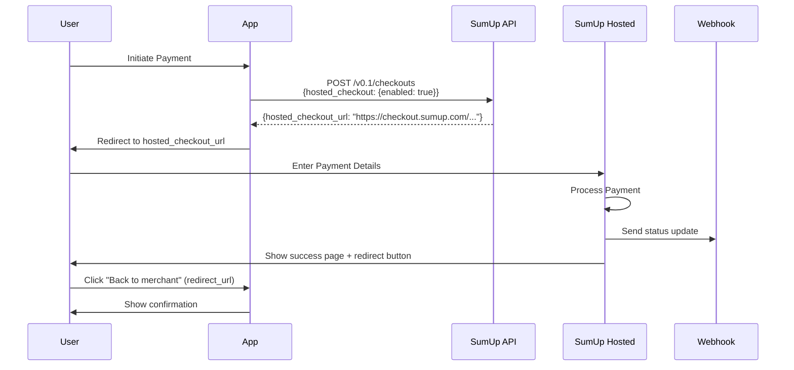

# SumUp Hosted Checkout Integration Fix

## Issue
SumUp API was not returning `checkout_url` in the response, causing payments to fail with "SumUp checkout missing redirect URL" error.

## Root Cause
According to [SumUp's official documentation](https://developer.sumup.com/online-payments/tools/hosted-checkout), to get a checkout URL from SumUp's API, you need to:

1. **Enable Hosted Checkout**: Add `hosted_checkout: { enabled: true }` to the API request
2. **Use the correct URL field**: The response contains `hosted_checkout_url` (not `checkout_url`)
3. **Provide redirect_url**: This tells SumUp where to redirect users after successful payment

## What is Hosted Checkout?

SumUp's Hosted Checkout is a complete, hosted payment page that:
- Handles the entire payment flow
- Supports all SumUp payment methods (cards, wallets, etc.)
- Provides success/failure/timeout pages
- Is fully PCI-compliant (you don't handle card data)

### Key Parameters

| Parameter | Description | Required |
|-----------|-------------|----------|
| `hosted_checkout` | `{ enabled: true }` to activate hosted checkout | **Yes** |
| `redirect_url` | Where to redirect users after **successful** payment | Optional* |
| `return_url` | Webhook callback URL for server notifications | Recommended |
| `cancel_url` | Where to redirect if user cancels payment | Optional |

*Note: According to SumUp docs, `redirect_url` doesn't affect payment method availability in Hosted Checkout, but it's needed for the success page "Back to merchant" button.

## Changes Made

### 1. Updated TypeScript Interfaces

**File**: `src/utils/sumupRealApiImplementation.ts`

Added support for hosted checkout parameters:

```typescript
export interface SumUpCreateCheckoutRequest {
  // ... existing fields
  redirect_url?: string; // URL to redirect after successful payment (for hosted checkout)
  return_url?: string; // Webhook callback URL
  hosted_checkout?: {
    enabled: boolean; // Enable hosted checkout to get hosted_checkout_url
  };
  // ... rest of fields
}

export interface SumUpCreateCheckoutResponse {
  // ... existing fields
  hosted_checkout?: {
    enabled: boolean;
  };
  hosted_checkout_url?: string; // URL for hosted checkout page (when hosted_checkout.enabled = true)
  checkout_url?: string; // Normalized field (contains hosted_checkout_url)
  // ... rest of fields
}
```

### 2. Updated API Request Payload

**File**: `src/utils/sumupRealApiImplementation.ts`

Added `hosted_checkout` and `redirect_url` to the API request:

```typescript
const apiPayload = {
  // ... existing fields
  hosted_checkout: { enabled: true }, // Enable hosted checkout
  redirect_url: checkoutData.redirect_url, // Where to redirect after success
  return_url: checkoutData.return_url, // Webhook callback
  // ... rest of fields
};
```

### 3. Updated Response Handling

**File**: `src/utils/sumupRealApiImplementation.ts`

Normalize the response to use `hosted_checkout_url`:

```typescript
// Normalize the checkout URL (prefer hosted_checkout_url over legacy checkout_url)
if (result.hosted_checkout_url) {
  result.checkout_url = result.hosted_checkout_url;
  console.log('✅ Using hosted_checkout_url from SumUp:', result.hosted_checkout_url);
}
```

### 4. Updated PaymentModal

**File**: `src/components/shared/PaymentModal.tsx`

Added `redirect_url` parameter:

```typescript
const checkoutResponse = await createSumUpCheckoutSession({
  // ... existing fields
  redirect_url: cancelRedirectUrl.toString(), // Where to redirect after successful payment
  return_url: sumupReturnUrl, // Webhook callback URL
  cancel_url: cancelRedirectUrl.toString(),
  // ... rest of fields
});
```

### 5. Updated Payment Request Utils

**File**: `src/utils/paymentRequestUtils.ts`

Added `redirect_url` for email payment links:

```typescript
const successRedirectUrl = `${baseUrl}/payment?request=${paymentRequestId}&status=success`;

const checkoutResponse = await createSumUpCheckoutSession({
  // ... existing fields
  redirect_url: successRedirectUrl, // Where to redirect after successful payment
  return_url: sumupReturnUrl, // Webhook callback URL
  // ... rest of fields
});
```

## Expected Result

### Before Fix
```json
{
  "id": "0cdd89cb-2d1a-4b78-9e79-7abcc13caa33",
  "status": "PENDING",
  "checkout_reference": "payment-request-147-1760260613373",
  "amount": 15,
  "currency": "EUR"
  // ❌ No checkout_url or hosted_checkout_url
}
```

### After Fix
```json
{
  "id": "64553e20-3f0e-49e4-8af3-fd0eca86ce91",
  "status": "PENDING",
  "checkout_reference": "b50pr914-6k0e-3091-a592-890010285b3d",
  "amount": 12,
  "currency": "EUR",
  "hosted_checkout": { "enabled": true },
  "hosted_checkout_url": "https://checkout.sumup.com/pay/8f9316a3-cda9-42a9-9771-54d534315676"
  // ✅ Now includes hosted_checkout_url
}
```

## Testing Checklist

- [ ] Deploy changes to UAT environment
- [ ] Create a payment request through the booking flow
- [ ] Verify console log shows: `✅ Using hosted_checkout_url from SumUp`
- [ ] Verify the URL is a real SumUp hosted checkout page (e.g., `https://checkout.sumup.com/pay/...`)
- [ ] Complete a test payment and verify webhook is triggered
- [ ] Verify user is redirected to success page after payment
- [ ] Test cancellation flow

## SumUp Hosted Checkout Flow



## Important Notes

1. **Sandbox vs Production**: Both sandbox and production environments should now support hosted checkout
2. **URL Normalization**: The code automatically maps `hosted_checkout_url` to `checkout_url` for backward compatibility
3. **Webhook**: The `return_url` is for server-side notifications, while `redirect_url` is for user browser redirects
4. **Success Page**: Without `redirect_url`, the success page won't have a "Back to merchant" button

## References

- [SumUp Hosted Checkout Documentation](https://developer.sumup.com/online-payments/tools/hosted-checkout)
- [SumUp Checkouts API Reference](https://developer.sumup.com/api/checkouts/create)
- [Previous UAT Configuration Guide](./SUMUP_UAT_CONFIGURATION.md)

## Deployment

```bash
# Commit changes
git add .
git commit -m "fix: Enable SumUp Hosted Checkout with hosted_checkout parameter"

# Push to UAT for testing
git push origin uat

# After UAT testing, merge to main
git checkout main
git merge uat
git push origin main
```
